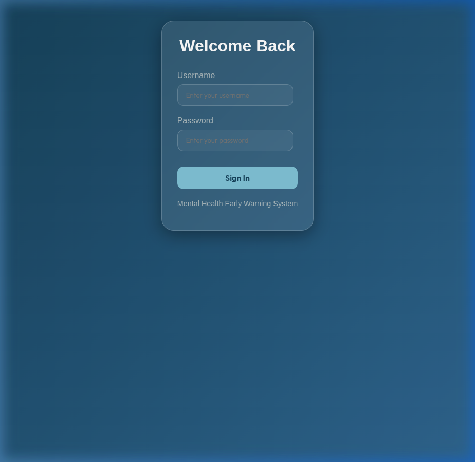
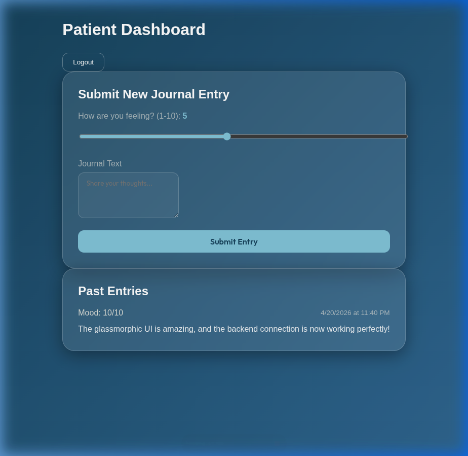
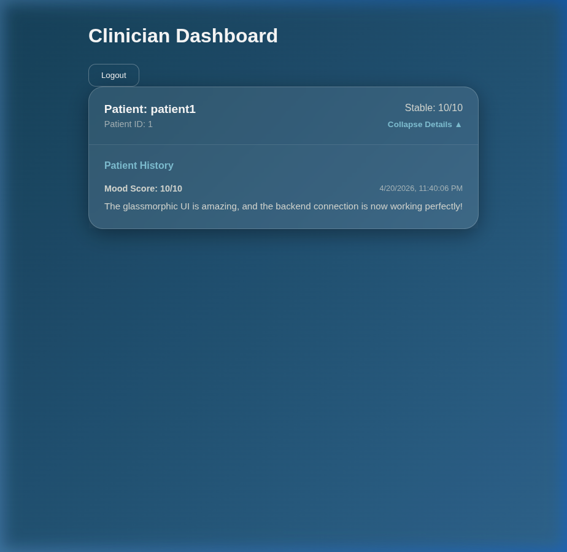

# Mental Health Early Warning System

A modern, full-stack web application designed for early detection and monitoring of mental health issues. Features a premium glassmorphic interface and a robust Spring Boot backend.

## 🌟 Key Features

- **Glassmorphic UI**: Premium, modern design with translucent "frosted glass" components and vibrant gradients.
- **Patient Dashboard**: Easy mood tracking and journal submission with historical data visualization.
- **Clinician Dashboard**: Patient monitoring with early warning indicators for critical mood scores.
- **Role-Based Access Control**: Secure JWT-based authentication for Patients and Clinicians.
- **Real-time Connectivity**: Seamless communication between the Vite/React frontend and Spring Boot backend.

## 📸 Guided Tour

### Premium Login Experience
The application welcomes users with a sleek, minimalist glassmorphic login card.


### Patient Dashboard
Patients can track their mood daily and maintain a journal, all within a clean, focused interface.


### Clinician Overview
Clinicians have a birds-eye view of all their patients, with warnings highlighted for those who may need immediate attention.


## 🛠️ Technology Stack

### Frontend
- **React 19 / Vite**
- **Vanilla CSS (Glassmorphism)**
- **Axios** for API communication
- **React Router 7** for navigation

### Backend
- **Spring Boot 4.0.5**
- **Spring Security & JWT**
- **Spring Data JPA**
- **H2 In-Memory Database** (for local development)

## 🚀 Getting Started

### Prerequisites
- Node.js (v18+)
- Java 21+

### 1. Run the Backend
```bash
cd backend
./mvnw spring-boot:run
```
*The backend is pre-configured with H2, so no MySQL setup is required for local testing.*

### 2. Run the Frontend
```bash
cd frontend
npm install
npm run dev
```

### 3. Test Credentials
| Role | Username | Password |
| :--- | :--- | :--- |
| **Patient** | `patient1` | `password` |
| **Clinician** | `dr_smith` | `password` |

## 👨‍💻 Project Structure
- `/frontend`: React application with Vite, styled with modern CSS utilities.
- `/backend`: Spring Boot REST API providing core services and security.
- `/docs`: Documentation and assets.
